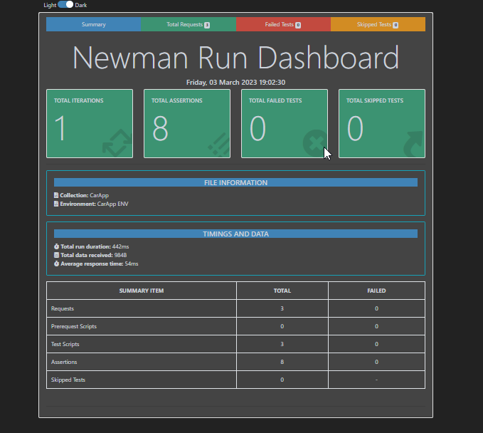

# Carapp Api
### CarApp API is a RESTful web service that takes a car type as input and returns a corresponding car.

## Build and run Docker
1. Navigate to the top-level directory of the repository.
2. Run the following commands:

```
 docker-compose build

 docker-compose up

```
This will start the following containers:
- carapp api service
- nginx 

## Build and run local

To build and run the API locally, follow these steps:


 #### Enivroment Setup
```sh
 virtualenv venv
 
 source venv/bin/activate # activate env in linux
 
 venv\Scripts\activate #activate env for Windows

 pip3 install -r requirements.txt
```

Start the API server:

```
python3 -m flask run --host=0.0.0.0
```

## API endpoint
```
 http://localhost:5000
```

## Usage
To use the API, send an HTTP GET request to the endpoint with a `type` parameter indicating the desired car type:

```
 curl -XGET http://localhost:5000/car?type=electrical
```


## Testing
To test the API using Newman, follow these steps:
1. Navigate to the `carapp_api_testing` directory.
2. Initialize a new npm package:
3. Install Newman:
4. Run the tests:

```sh
 npm init
 npm install newman
 npm test 
```

Also run tests using Postman Collection.


